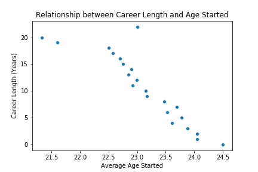
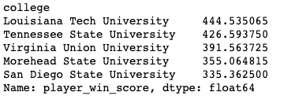
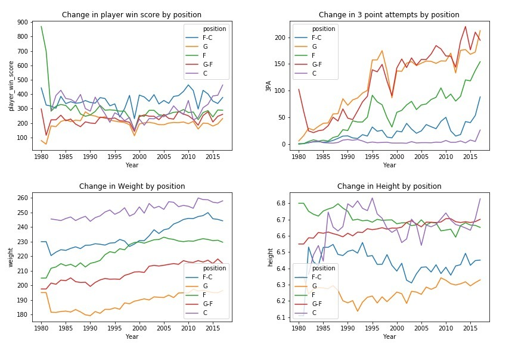

# Exploring the Ideal NBA Player

## Introduction
With the rise of sports analytics, comes the increasing demand for efficiency and data driven decisions in recruiting new players for NBA teams. Instead of simply eyeballing a player and gauging their surface level playing stats (pts, shot attempts, etc), we can now look at an entire list of detailed stats that range from the box score metric, which estimates a player's contribution to the team, to simpler metrics of offensive rebounds. With these metrics, we can compare players and determine who would be a good fit for a specific team based on their qualities. 
## Goal
In our project, we will utilize these metrics to **determine the type of players recruiters should look for based comparing player stats and the trends that occur over time in the NBA.** In order to accomplish this, we will use stats of over 4,000 players from 1950 - 2018 (gathered from: https://tinyurl.com/ybroccrf) and explore the data.

Moreover, we will answer these 3 questions to get a better idea of the ideal NBA player.
1. **What is the average career length a player has? Does it change based on the age started?**
    - This will help answer questions of player's longevity and shine light on who succeeds long term vs short term.
    
    
2. **Which colleges produce the players with the best stats?**
    - While it is hard to compare the intensities in college basketball vs the NBA, colleges with better stats may be an indication of a good basketball program that can output potentially great NBA players. 
    
    
3. **How have basketball roles changed over the years?**
    - For example, if we notice that Centers are becoming more technical over the years, recruiters will want to look for a Center that possesses that technical ability. 
    
## Analysis
#### The Ideal Player
Based on our data, the **ideal NBA player is 255 .lb, 21 - 22.5 year old Center from Louisiana Tech University**. 

#### Breakdown 
1. **What is the average career length a player has? Does it change based on the age started?** To answer this question, we found the frequencies of each career length first. Interestingly, we discovered there was a high frequency of players who had 0 - 4 years of basketball. This seemed very unsual as the average retiring age in the NBA is 36 - 39. Did players get injuries? Were they not good enough to continue in the NBA, so they left to another league? Or did they retire early? We further explored if there was a correlation between the age they started and the career length. We did discover a correlation, and while this may seem intuitive, we also found that those who started around 24 had an average career length of 5 years. This would mean they would retire around 29, far from the average NBA retirement age. As a result, we concluded that 21 - 22.5 was the best age to target. 

2. **Which colleges produce the players with the best stats?** Due to the missing data, we first had to do probabilistic imputation to impute the missing values for colleges and birth_date. Once we finished, we merged the player_data with seasons_stats to get the stats for each player. We decided to use a new metric to compare players to each others. This metric is the **player win score**. With this metric, we can give more reasonable weights to certain actions. For example, since the formula for win score is **points + rebounds + steals + .5(assists) + .5(blocked shots) - FG attempts - turnovers - .5(FT attempts) - .5(personal fouls), we can see that certain actions (assists, blocked shots, etc) either give half its value or take away.** Lastly, we decided to remove colleges with 2 or less players to make sure that one amazing player was not the only reason for a college's good performance. 

Louisiana Tech came up on top. It is important to realize that this can change because we did probabilistic imputation. However, because it follows the distribution of the data, it is likely that only the top 5 with switch with each other. Furthermore, when we look in the NBA, we usually do not see big name Louisiana Tech alumni. This goes to show that stats do not necessarily indicate good predictive power. On the other hand, it could mean that Louisiana Tech players are underrated by most people.

3. **How have basketball roles changed over the years?** We will analyze 4 characteristics by position and how they changed over time: player win score, 3 point attempts, weight and height. The first two deal with the technical aspects of the game while the last two deal with the physicality. 

If we look at the player win score graph (Upper left), we see that Centers have recently begun to have a larger impact in games, more so than any other position. This is very interesting to see as most would think that Guards have the most impact in games. If you look at the 3 point attempts graph (Upper right), the NBA is transitioning into a more shooting based game rather than driving into the paint and doing a layup. Players are looking to shoot more, even centers as well. In terms of weight (Bottom left), the increasing trend in weight may indicate a higher physicality and emphasis on physical conditioning and training. However, the height remains constant, which makes sense as higher height will always be prioritized and there is a threshhold of maximum height for humans. 

## Conclusion
From our analysis and the data, we discovered the ideal age range of NBA rookies to target is 21 - 22.5 years old. Rookies from that age range tend to have longer careers (20) while career length decreases as you increase age. Moreover, players from Lousiana Tech University come out on top for players with the highest "player win score" metric. And when doing analysis of stats by position over time, Centers began having a greater impact on the basktball court. 

It was very interesting to see the correlation between age started and career longevity, which University came up on top, and which positions are having greater importance. However, it is important to understand that correlation does not indicate causation. From this analysis, I think that statistical proverb is most clear with the Lousiana Tech Univeristy example. With a quick analysis, we can see that there are no NBA "greats", albeit it could indicate that players from Lousiana Tech are dreadfully underrated. 
